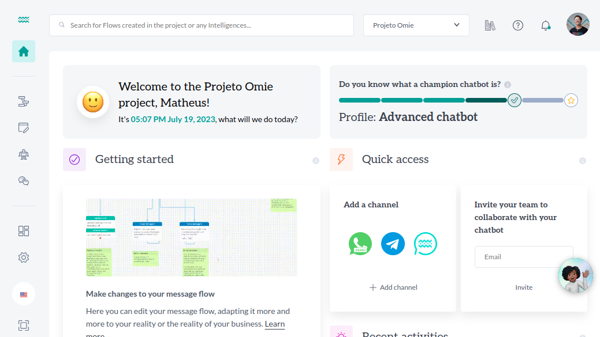

<div align="center">


[](https://codecov.io/gh/weni-ai/weni-webapp) [](https://opensource.org/licenses/MPL-2.0)

# :desktop_computer: Weni-Webapp

This repository is responsible for integrating the other modules ([Flows](https://github.com/weni-ai/flows/), [Artificial Intelligence](https://github.com/weni-ai/ia-platform-frontend), [Integrations](https://github.com/weni-ai/weni-integrations-webapp), [Chats](https://github.com/weni-ai/chats-webapp) and [Academy](https://github.com/weni-ai/weni-academy)), making them the [Weni Platform](https://dash.weni.ai/) using microfrontend architecture.

</div>

# About Weni Plataform

The Weni Platform allows the creation of chatbots in a simple and fast way, improving communication with customers and automating processes. It can be integrated with various chat, messaging and social media solutions, serving companies of different sizes that want a robust service solution to offer customer support or manage internal processes. The platform can be used in various sectors, such as sales, marketing, finance, human resources, among others.

In addition, the Weni tool offers features to provide duplicate payment slips, list installments available for payment, create opportunities and register new customers, provide 24/7 customer service and create FAQs to clarify doubts, among other existing processes in the company. This reduces work, optimizes tasks and streamlines service, providing a humanized and interactive conversational flow.
> [Usability documentation](https://docs.weni.ai/l/pt)



# Technologies

- [Vue 2](https://v2.vuejs.org/)
- [Unnnic](https://github.com/weni-ai/unnnic) (Weni's Design System)
- [Vue Router 3 for Vue 2](https://v3.router.vuejs.org/)
- [Vuex 3 for Vue 2](https://v3.vuex.vuejs.org/)
- [Vue I18n v8.x for Vue 2](https://kazupon.github.io/vue-i18n/)
- [Sass](https://sass-lang.com/)
- [Axios](https://axios-http.com/)

# Requirements
Before running the application, make sure you have installed the following tools on your machine:

- [Node.js 18.16.1](https://nodejs.org/en)
- [NPM](https://www.npmjs.com/) or [Yarn](https://yarnpkg.com/) (recommended)

# Setup

1. Open the terminal and clone the repository

```
git clone git@github.com:weni-ai/weni-webapp.git
```

2. Enter the created directory

```
cd weni-webapp
```

3. Install the dependencies

```
yarn
```


# How to develop
## Environment variables

1. Rename the .env.sample file to .env.local
2. Configure the .env.local following the patterns below

| Variable | Type | Default | Description |
|--|--|--|--|
| VUE_APP_ROOT_API | `string` | Empty | HTTP service API URL ( remember to pass "/" at the end)
| VUE_APP_KEYCLOAK_ISSUER  | `string` | Empty | Keycloak base API
| VUE_APP_KEYCLOAK_CLIENT_ID  | `string` | Empty | Keycloak client ID
| VUE_APP_KEYCLOAK_REALM  | `string` | Empty | Keycloak Realm
| VUE_APP_SENTRY_DSN_ENDPOINT  | `string` | Empty | Sentry DSN endpoint
| VUE_APP_HELPHERO  | `string` | Empty | HelpHero identifier
| VUE_APP_STRIPE_API  | `string` | Empty | Stripe Public Key
| VUE_APP_BOT_URL  | `string` | Empty | Internal Bot URL
| VUE_APP_2FA_APP_ANDROID  | `string` | Empty | Two-factor authentication App Link for Android
| VUE_APP_2FA_APP_IOS  | `string` | Empty | Two-factor authentication App Link for iOS
| VUE_APP_LOGROCKET_ID  | `string` | Empty | LogRocket ID
| VUE_APP_LOGROCKET_CHILD_DOMAINS  | `string` | Empty | LogRocket Comma-separated Child Domains URLs
| VUE_APP_URL_ACADEMY  | `string` | Empty | Academy module URL
| VUE_APP_URL_FLOWS  | `string` | Empty | Flows module URL
| VUE_APP_MODULE_CHATS  | `string` | Empty | Chats module URL

## Tokens
...


## Execution

Start the server with:

```
yarn serve
```

After that, it will be available at http://localhost:9000.

# Development Workflow

| Command | Description |
|--|--|
| yarn install | Install dependencies
| yarn serve | Run serve with hot reload at localhost:9000
| yarn build | Build for production with minification
| yarn lint | Show lint warnings and errors
| yarn test:unit | Run all tests
| yarn test:unit --watch | Run test in watch mode
| yarn translations:build | Build the unified translations.json into separated translation files
| yarn translations:suggest | Generate English and Spanish translations from Portuguese input

# Open-Source Governance

The Weni Platform open source projects are governed by [@weni-ai](https://github.com/weni-ai/). Weni opens all its software parts under terms of an open-source license to reach potential users and partners mainly. Secondly, Weni wants to reach developers by building a community for some pieces that are more reusable in other businesses or software projects, such as NLP models or tools. Besides that, the openness of our software is also related to building trust by enabling our external stakeholders to audit the security of our software.

# Community

- Join our [community chat](https://community-chat.weni.ai) to discuss with our internal team
- Join [#dev](https://community-chat.weni.ai/channel/dev) for help from the community to development issues

# Contributing

**We are looking for collaboration from the Open Source community!** There's so much we want to do,
including but not limited to: enhancing existing applications with new features,
optimizing the NLP tasks and algorithms involved that boost accuracy, new communication channels and integrations.

* Please read our [contribution guidelines](https://github.com/ilhasoft/weni-platform/blob/main/.github/CONTRIBUTING.md) for details on what and how you can contribute.
* Report a bug by using [this guideline](https://github.com/ilhasoft/weni-platform/blob/main/.github/CONTRIBUTING.md#report-a-bug) for details on what and how you can contribute.
